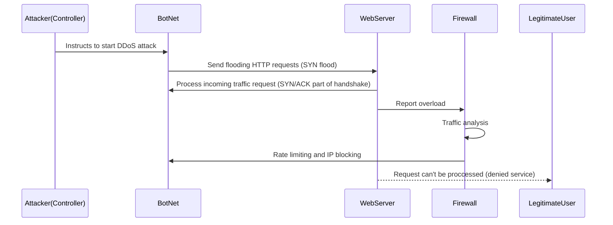

## Explanation

DDoS attacks are one way hackers try to disrupt a target's service(s). There are a few types of DDoS attacks, though a common one is SYN flooding. SYN flooding is when the attackers floods the webserver with a larger number of fake request. The fake request is the initiation request for the TCP/IP's three-way handhsake (SYN, SYN/ACK, ACK), where the botnet sends SYN only request to never complete the three-way handshake (not sending ACK). The incomplete handshake request leaves the connected port of the webserver occupied and unavailable to process more requests. The attacker floods all open ports to prevent other users from accessing the webserver, hence the name of the attack type DDoS (distrubted denial of service).

The general steps for this type of attack and mitigation based on the sequence diagram are as follows:

1. The attacker initiates the attack by using a computer that acts as the controller for the botnet.
2. The botnet then floods the webserver with fake TCP requests by only sending the first part (SYN) of the three-way handshake.
3. The webserver tries to process the TCP/IP traffic by sending the second part of the handshake (SYN/ACK) and waiting for an ACK response. The botnet ignores the SYN/ACK response.
4. The ports for web traffic are then stuck occupied and unable to process real traffic requests from legitimate users, which results in the denial of service to legimate users.
5. The firewall recieves report of webserver traffic instability.
6. The firewall analyzes the web traffic request to determine the malicious IPs of the botnet.
7. The firewall blocks the IPs of the botnet attacking the webserver and/or rate limits the number of request coming from the botnet.
