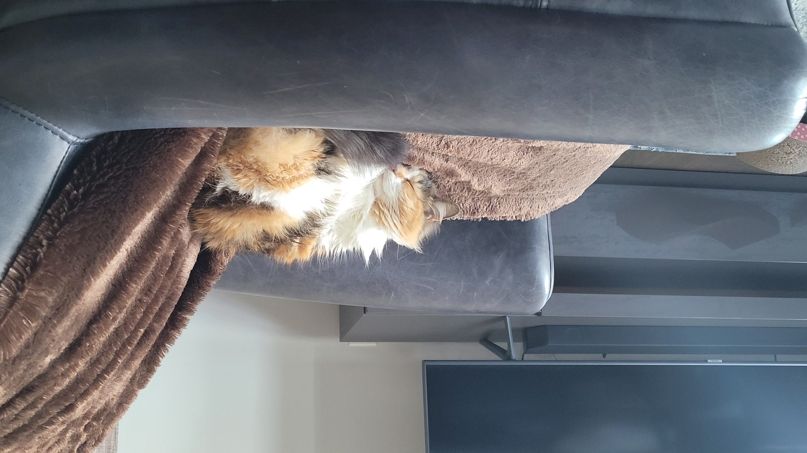

## Hi there 👋

1. Houston Culpepper, hculpepper@my.waketech.edu
2. This is my school account for CTI-110-0005
3. This repository will hold all my work for this class

# **About Me**

## Interest And Focus

- Listening to music 🎶
- My cat, Cyra 🐈  

- Playing games (mostly PC) 💻
- I also enjoy spending time researching and learning more about cybersecurity threats. 🏴

## Cybersecurity Websites I recommend

- [San's ISC Stormcast podcast][sans] is a short daily update about current cybersecurity news.
- [Kreb's on security][krebs] is a blogpost site that covers a large variety of world cybersecurity news.
- [Threat Post][threatp] is a cybersecurity news site that also has a podcast. The site covers current threats and other infosec related content.
- [Darknet Diaries][dd] is a podcast that covers cybersecurity culture, stories, and historical events for educational and entertainment purposes.

[krebs]: https://krebsonsecurity.com/
[sans]: https://isc.sans.edu/podcast.html
[threatp]: https://threatpost.com/
[dd]: https://darknetdiaries.com/
